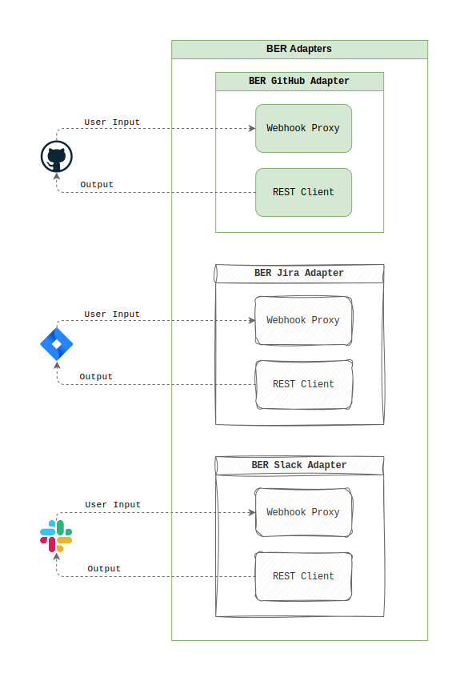

## Summary

The BERAdapter is client-facing interface that is implemented for any system that has a method to communicate real-world input with a BERAgent. An adapter is defined for a specific interface which may be a platform e.g. Github; or a terminal.

### Inputs
 - Natural language

#### Messages

Messages flow through a validation pipeline:

1. Author verification (skip bot messages)
2. Intent detection ("@ber" mentions)
3. Content extraction (body parsing)

### Outputs
 - Natural language
 - Templated, structured response
 - Visualisation

## Example
### GitHub Events

The BER system primarily processes GitHub events as input signals:

- **Issue Comments**: Natural language requests prefixed with "@ber"
- **Issue Creation**: Initial problem statements and documentation requests
- **Issue Events**: Added or removed `labels` call the attached `BERAgent`
- **Installation Events**: System setup and initialization triggers

