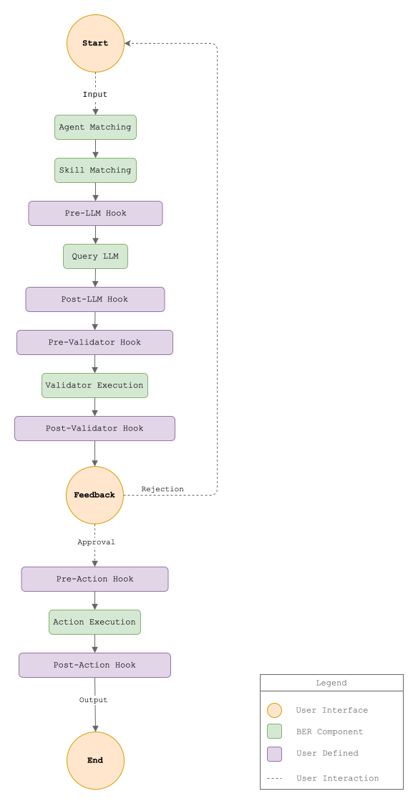

## Overview

A BERAgent is a container of skills covering a specific knowledge domain. BERAgents will process messages in natural language and produce task specific structured responses. It does this through a sequence of interaction by the SHAV architecture (Skills, Hooks, Actions, Validations). Each agent is a collection of one or more Skills, zero or more Hooks, zero or more Actions, and zero or more Validations. In this sense there is no difference between pre-built agents and custom agents you can create in your domain.

## Quickstart
<!-- TODO tbd -->

## Concept of a BERAgent
BER framework defines domain executors - `Agents` - who can accomplish tasks with their command card. The command card has slots for domain specific templates and prompts which are identified as `Skills`. With the application of their skills they try to fulfill the request and return a structured, directed response.

During request parsing they can run skill-specific `validators`. `BERAgents` can follow up on the response, by running specified `actions`. The real-world user can determine the action to take by selecting the correct action based on the response. During the workflow execution the framework provides `hooks` to listen to / interact with the environment. All of this can be used as-is or extended as-wanted.

### SHAV architecture
BERAgents can be employed as actors in domains because of the introduction of constraints and add-ons to the basic, simple prompt request you would send to any LLM-based AI model. This multi-layered approach gives to 2 very positive advantages.
 1. Enhances the results across metrics such as precision of the answer, the direction of the skill employed, reliability and repeatability of requests.
 2. Allows extensibility, configuration in how an agent uses their skills and how the procedure processes the input, the skill, the output.

#### Skills

#### Hooks

#### Actions
Correspondence with the agent can be continued on a custom basis depending on user settings and agent configuration.

#### Validators

## Tutorials
### Add a validation rule to filter fake URL refs

## Settings
 Each autonomous unit is built from multiple layers and each layer can be customised separately. These configurations are defined as `golang` code. The table below details the fields and values that determine the final configuration of an agent.

## Examples
### SHAV pattern processing
The system implements a chain-of-responsibility pattern where responses flow through the SHAV architecture:

1. Skill selection, template rendering, NLP (skills)
2. Pre- and post-processing, pre- and post-rendering, side effects (hook triggers)
3. Data operations, CRUD, logging, communication (action execution)
4. Type checking, enumeration, field presence, schema marshalling (validation of rules


  It is mandatory for an agent to have at least 1 skill defined.

  All other capabilities are optional however their usage is highly recommended.


### Agent Specializations
#### Documentation Agents

> Like technical writers with different specialties

- **DocAuthor**: Implements the [Diátaxis framework](https://diataxis.fr/) for documentation architecture. Transforms natural language requests into structured technical documentation.
- **MermaidAgent**: Specialized in [UML](https://en.wikipedia.org/wiki/Unified_Modeling_Language)-style diagram generation using the Mermaid markup language.

#### Management Agents

> Like project management tools with natural language interfaces

- **AgentBuilder**: Meta-agent that generates new agent configurations, similar to a factory pattern for AI components.
- **ProductOwner**: Applies agile methodology patterns to analyze and refine product backlog items.
